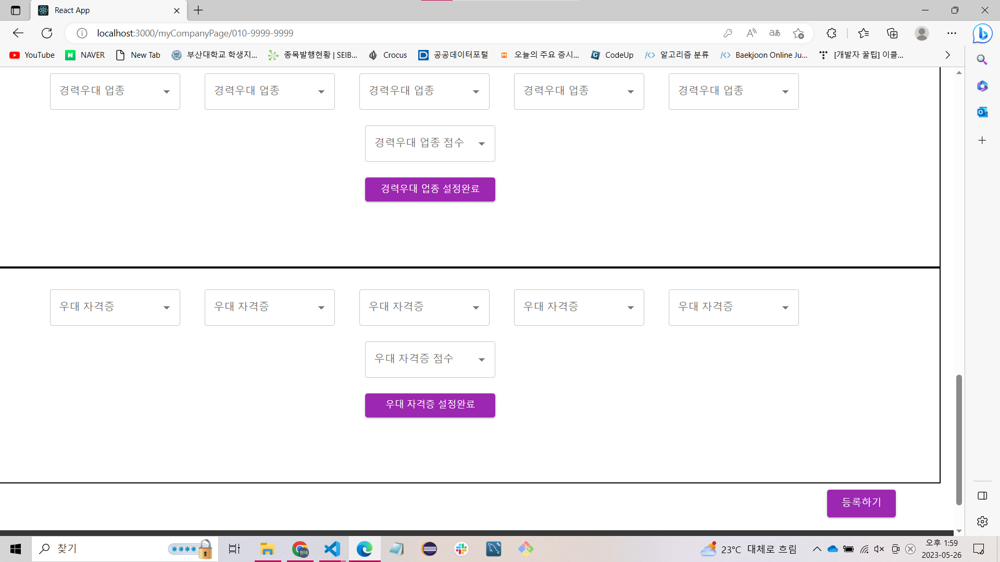

# 나의 위치는 어디쯤 인가? 
 
 
 
 

# 프로젝트의 배경:
항상 벼랑 끝에 내몰린 마음을 가지고 회사에 지원하는 취업 준비생들의 불확실성 해소와 자신의 위치를 대략적으로 알 수 있도록 해 주고자 하는 의도 

# 기존의 취업 플렛폼과의 차이점: 지원한 회사에서의 나의 대략적인 위치를 알 수 있다.
==> A 라는 회사에서 나의 백분위 점수가 하위권(20점 : 상위 80%)이다(다수중에서 내가 하위권에 속한다) ==> 그 회사는 전력적으로 포기하고 다른 회사에 힘을 실을수 있다.

**효과**: 나의 위치를 직관적으로 알 수 있다.

# 사용 방법과 순서
 
1. 회원가입과 로그인(기존의 로그인 회원가입 시스템과 동일)
 
 
3. 기업이 회원가입 후 기업의 마이페이지로 들어간다.
 
 
4. 회사에서 희망하는 지원자의 능력들에 점수를 부여한다(회사에서 지원자의 스펙에 대하여 장벽을 친다라고 표현)
 
 
 
 
 
 
5. 지원자들은 자신의 능력, 스펙을 웹 페이지에 등록한다.
 
 
 

6. 등록 후 자신이 지원을 원하는 회사의 이미지에서 "Percentile"이라는 버튼을 누르면 자신의 백분위가 어떤지 알 수 있다.
 
 
 

